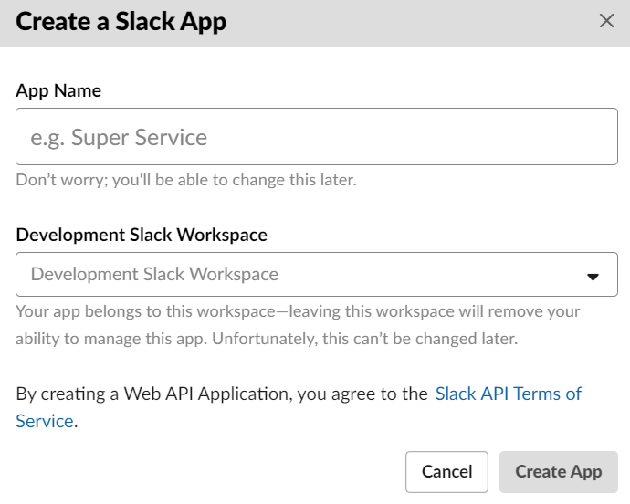
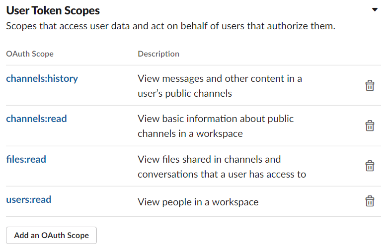
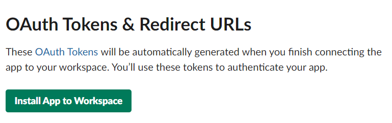

# SLACK_LOG_GAS

パブリックチャンネルにあるSlackのログをGoogle Apps Script (GAS)を用いてGoogle Driveに保存するためのプログラムです．プライベートチャンネル対応の場合にはトークンの権限などを操作することで可能です．

If you prefer English, see [README_en.md](README_en.md), please.

このプログラムはSlack APIの[conversations.history](https://api.slack.com/methods/conversations.history)を利用します．[channels.history](https://api.slack.com/methods/channels.history)は利用しません．`channels.history`については
> "channels.history" method is deprecated. It will stop functioning in February 2021 and will not work with newly created apps after June 10th, 2020).

というように，つまり`channels.history`は使えなくなる旨のアナウンスされています．Slack側としては`channels.history`(パブリックチャンネル)，`groups.history` (プライベートチャンネル)，`im.history` (DM)，`mpim.history` (複数人のDM)の扱いを`conversations.history`に統合したいようです．その一方で，`channels.history`などでは取得できていたスレッド内の投稿が`conversations.history`ではできなくなってしました．スレッド内の投稿はスレッド元の投稿のチャンネルとタイムスタンプで一意に特定できるようであり，取得のためにはチャンネルとタイムスタンプを用いて`conversations.replies`というAPIを呼び出す必要があります．

**NOTE**:  
スレッド内の投稿を取得するため，このプログラムでは[conversations.replies](https://api.slack.com/methods/conversations.replies)を利用します．このAPIはそれぞれのスレッドごとに1回呼び出す必要があります．さらに，`conversations.replies`はRate limitingが`Tier 3`，つまり1分間に50回程度しか呼び出すことができず超過した場合にはAPIを呼び出してもエラーが返ってきます．この制限を守るため，Google Apps Scriptの実行時間の制限(G Suite Business / Enterprise / Education以外の場合には6分程度, [https://developers.google.com/apps-script/guides/services/quotas](https://developers.google.com/apps-script/guides/services/quotas))を超える可能性があります．
**実行時間の超過を防ぐため，1回の実行では1つのチャンネル内の投稿のみ取得します．全チャンネルのスレッドの投稿を取得するためには，チャンネル数と同じ回数実行する必用があります，**

# Usage
## Step1: Slack Appを作成する
**NOTE**
各WorkSpaceでSlack Appを1つ作成する必要があります。(無料プランを利用してる方が閲覧しているかと存じますが) 無料プランを利用している場合，10件のアプリしか導入できないことに留意してください．

1. [https://api.slack.com/apps](https://api.slack.com/apps)にアクセスします．
1. "Create a Slack App"をクリックし，フォームに記入します．
    

    
    

1. "OAuth & Permissions"に移動し，"Scopes"内にある"User Token Scopes"を見つけ，"Add an OAuth Scope"をクリックして以下の4つのOAuth Scopesを追加します．
    1. channels:history
    1. channels:read
    1. files:read
    1. users:read
    

    
    

1. "Install App to Workspace"をクリックしてワークスペースにインストールし，"OAuth Access Token"を控えておきます．
    

    
    

## Step2: Google Apps Scriptプロジェクトの作成
1. Google DriveなどからGoogle Apps Scriptのプロジェクトを作成します．
2. プロジェクトのフォルダIDを確認します．プロジェクトのGoogle DriveのURLが"https://drive.google.com/drive/folders/hogehoge"ならば，folder ID は "hogehoge"です．
1. [slack_log_gas.gs](slack_log_gas.gs)をコピー&ペースト等を用いて作成します．
1. [slack_log_gas.gs](slack_log_gas.gs)の1, 2行目の`FOLDER_NAME`と`SpreadSheetName`を自身の設定したいログのフォルダ名とスプレッドシート名に変更してください．
1. ファイル->プロジェクトのプロパティから「スクリプトのプロパティタブ」に移動し，以下の3つのプロパティを追加します．
    |  Key  |  Value  |
    | ---- | ---- |
    |  slack_api_token  |  Slackで控えたOAuth Access Token |
    |  folder_id  |  hogehoge  |
    | last_channel_no | -1 |
1. GUIを用いた設定がうまくできない場合には[set_properties.gs](set_properties.gs)を用いてみてください．その際，値を自身のものに置き換えてください．
1. `Run`関数を実行するか，トリガーの設定をします．全チャンネルの全スレッドを取得したい場合にはチャンネルの数と同じ回数の実行が必用です．
1. "Authorization required"のポップアップが出てきた場合には言われた通り権限を設定してください．

# Limitations
- 残念ながら，すべてのファイルが保存されるわけではありません（解決されていません)
- チャンネルにも送信されるスレッド内のメッセージ (thread_broadcast) は，SpreadSheetに2回書き込まれます．また，そのメッセージ以降のスレッド内の投稿が重複します．
- スレッド内の投稿についてはチャンネルごとに前回のログ取得時の最新のログから1か月前より後に**チャンネルに**投稿された(つまりスレッド内の投稿でない)メッセージ内のスレッドを追加します．チャンネルへの投稿が1か月より前かつスレッドへの投稿が1か月以内のものは取得されません．
