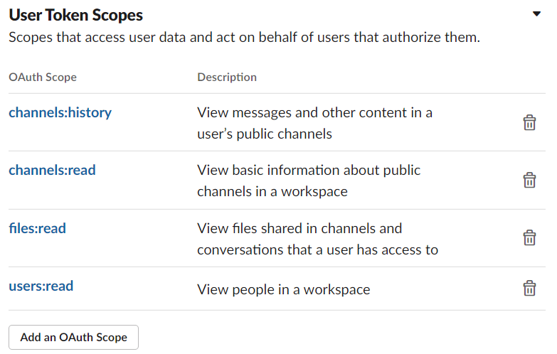
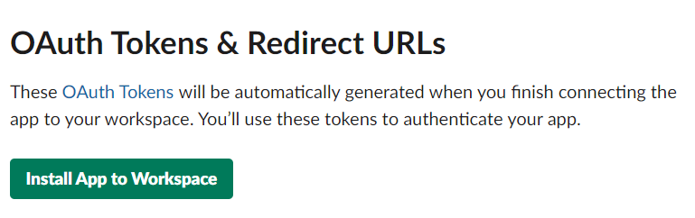

# SLACK_LOG_GAS

Save logs in public channels of Slack messages and files in Google Drive with Google Apps Script (GAS). If you want to get logs in private channels, change the permissions of your slack token.

Ths program use slack api of [conversations.history](https://api.slack.com/methods/conversations.history), not [channels.history](https://api.slack.com/methods/channels.history).
So you can use after "channels.history" is abolished (
"channels.history" method is deprecated. It will stop functioning in February 2021 and will not work with newly created apps after June 10th, 2020).

**NOTE**:  
To get replies, this program use [conversations.replies](https://api.slack.com/methods/conversations.replies). This API is called in each thread, so the number of calling API may much than the number of calls that can be used within a time limit (about some minutes if you don't use G Suite Business / Enterprise / Education, [https://developers.google.com/apps-script/guides/services/quotas](https://developers.google.com/apps-script/guides/services/quotas)).
**To avoid this thing, threads in only one channel are collected in each run. In order to get posts from threads on all channels, you need to run as many times as there are channels.**

# Usage
## Step1: Create Slack App
**NOTE**
You have to make one app of Slack in each WorkSpace. If you use a free plan (and I think you use a free plan), only ten applications are allowed to make.

1. Access [https://api.slack.com/apps](https://api.slack.com/apps)
1. Click "Create a Slack App" and fill out the form for the application
    

    
    

1. Access "OAuth & Permissions", and in "Scopes" > "User Token Scopes" click "Add an OAuth Scope" and add four OAuth Scopes
    1. channels:history
    1. channels:read
    1. files:read
    1. users:read
    

    
    

1. Click "Install App to Workspace" and keep a copy of "OAuth Access Token"
    

    
    

## Step2: Make a Google Apps Script Project
1. Access your Google Drive and make a project
2. Check the folder ID of the project. If URL of your project is "https://drive.google.com/drive/folders/hogehoge", folder ID is "hogehoge".
1. Copy and paste [slack_log_gas.gs](slack_log_gas.gs)
1. Change `FOLDER_NAME` and` SpreadSheetName` on the 1st and 2nd lines of [slack_log_gas.gs](slack_log_gas.gs) to the folder name and spreadsheet name of the log you want to set.
1. Add the following three properties in the script properties.
    |  Key  |  Value  |
    | ---- | ---- |
    |  slack_api_token  |  Your OAuth Access Token in Slack  |
    |  folder_id  |  hogehoge  |
    | last_channel_no | -1 |
1. If you cannot set properties using GUI, it is good to use [set_properties.gs](set_properties.gs). Please replace values your own properties.
1. Run `Run` function or make a trigger. If you want to save all replies in all channels, you have to run as many times as the number of channels
1. If "Authorization required" popup is appeared, check the permission.

# Limitations
- Unfortunately, not all files are saved (not resolved)
- Messages in a thread also sent to channel (thread_broadcast) are written twice in SpreadSheet. Also, the posts in the thread after that message will be duplicated.
- For posts in threads, add threads in messages posted to the **channel** (that is, not posts in threads) more than one month before the latest log at the time of the previous log acquisition for each channel. Posts posted to the channel before 1 month and posted to the thread within 1 month will not be acquired.
